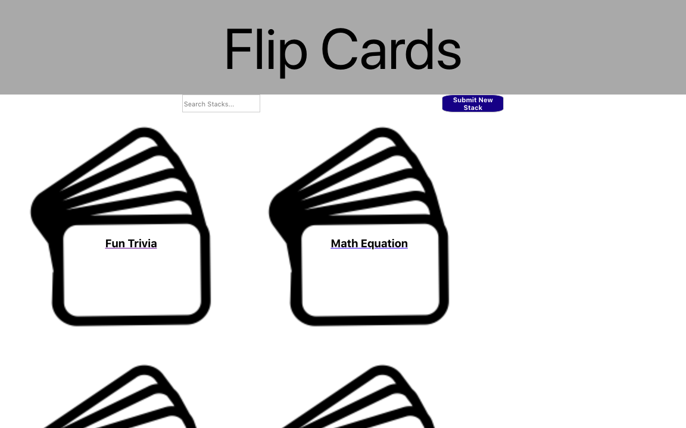

# Project 3 

The objective of this project was to build two models in an Express/Mongo Server and Front End via React. One model have Full CRUD and a second model have Add/Delete.

# Flip Cards

* Welcome to Flip Cards, an App that stores your flash cards in Decks! 

* "Well thats pretty common..." consumers say, "What sets you apart?"

* Well, we are easy to fill out and view! 

* Easy to Delete or Add as many cards as you want!

* Build as many decks as you want!

* Search through your deck names with a search bar.

* One sheet you can tab through to fill out or edit your cards. 

* Also to flip our cards to reveal the back with a click on mobile or 
 mouse over on desktop! 

* Change card color, font color, and card size as wanted!

>Try using us for studying,
>Memorizing acting lines, 
>Learning a new Language,
>'Spice up' your About Me at the start of a next Lecture, 
>More interesting slide show introductions,
>Teachers use us to introduce a topic or to make multiplication tables more fun! 

* What do you put on your Flip Cards? 
#FlipCard #letUsKnow 

This App was made using: **React MongoDB Express Node**

Heroku: https://gentle-beyond-96466.herokuapp.com/
GitHub: https://github.com/DestinFloyd/Project3
Trello: https://trello.com/b/IjbWsarW/project-3

# Opening 

# Default view - hover card to flip it... 

# Customize Card and Font color and size 

# Wireframe / ERD 

